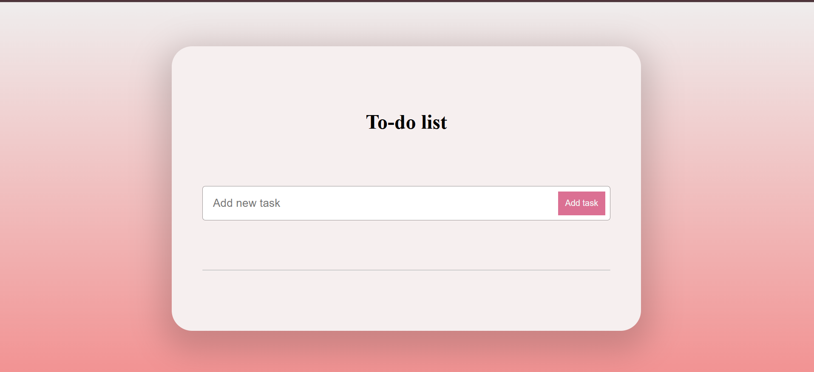
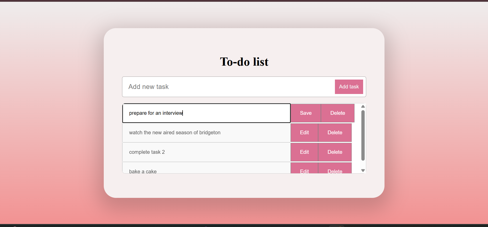
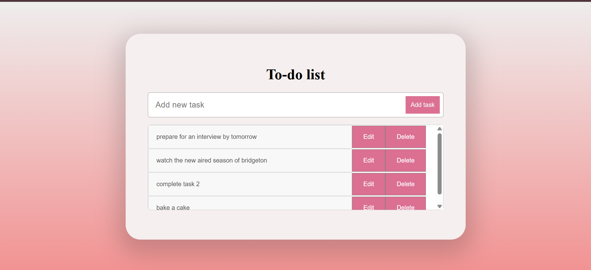

# 📝 Todo List App (TypeScript)

This is a simple, clean, and responsive **Todo List Web Application** built using **TypeScript, HTML, and CSS**.  
The app allows users to **add**, **edit**, and **delete** tasks dynamically.  
All tasks are saved in the browser using `localStorage`, so your data is preserved even after refreshing or closing the browser.

---

## 🚀 Features

- Add new tasks with a single click or by pressing Enter  
- Edit tasks inline using the edit button  
- Delete tasks by clicking the delete button  
- Tasks are persisted in the browser with `localStorage`  
- Responsive UI with hover effects and scrollable task list  

---

## 📸 Screenshots

### 🏠 Start Page

*The initial view of the Todo List app.*

### ➕ Add Task

*Adding a new task to the list.*

### ✏️ Edit Task

*Editing an existing task.*

### 💾 Save Task

*Saving changes after editing a task.*

---

## 💻 How to Run the App

1. **Clone the repository**:  
   ```bash
   git clone <your-repo-link>
   cd todo_task2
   ```
2. **Open `index.html` in your browser** to use the app. Both `todo.ts` (source) and `todo.js` (compiled JavaScript) are included, so you do not need to compile anything unless you want to make changes to the TypeScript code.

3. **(Optional) If you modify `todo.ts`, recompile it:**
   ```bash
   npm install -g typescript   # if you don't have it
   tsc todo.ts
   ```
   This will update `todo.js` with your changes.

---

## 🛠️ Usage Instructions
- **Add a task:** Type your task in the input box and press the Add button or hit Enter.
- **Edit a task:** Click the Edit button next to the task, modify the text, then click Save to update.
- **Delete a task:** Click the Delete button next to the task to remove it.

---

## 📂 Project Structure
```
todo_task2/
├── index.html         # Main HTML file
├── styles.css         # CSS styles
├── todo.ts            # TypeScript source code
├── todo.js            # Compiled JavaScript
└── screenshots/       # Screenshots for documentation
```

---

## ⚙️ Technologies Used
- HTML5
- CSS3 (with responsive design and hover effects)
- TypeScript (compiled to JavaScript)

---

## 📝 Assignment & Grading Criteria

**Task 2: Developing a Simple Todo List App with TypeScript**

- Create a TypeScript file (`todo.ts`).
- Define an interface for a to-do item.
- Implement functions to add, remove, and display to-do items.
- Compile the TypeScript file to JavaScript and test it in the console.
- Upload the application to your GitHub account.
- Include a README.md file with a project description and instructions.
- Add the link to your GitHub repository to the progress tracker Google Sheet.
- **Provide a screenshot of every page in the README file with a description (mandatory).**

### Grading System (Total: 15 points)
- Create a Todo List application using TypeScript. (3 points)
- Allow users to add, edit, and delete tasks. (2 points)
- Use the concepts covered in the video tutorials. (1 point)
- Test the application to ensure it works as expected. (1 point)
- Create a README.md file with a description and instructions. (2 points)
- Upload the application to your GitHub account. (3 points)
- Add the link to your GitHub repository to the progress tracker Google Sheet. (3 points)
 