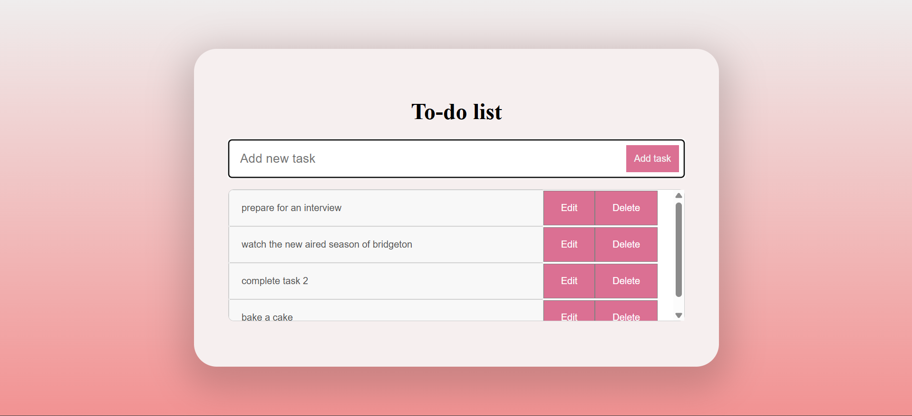
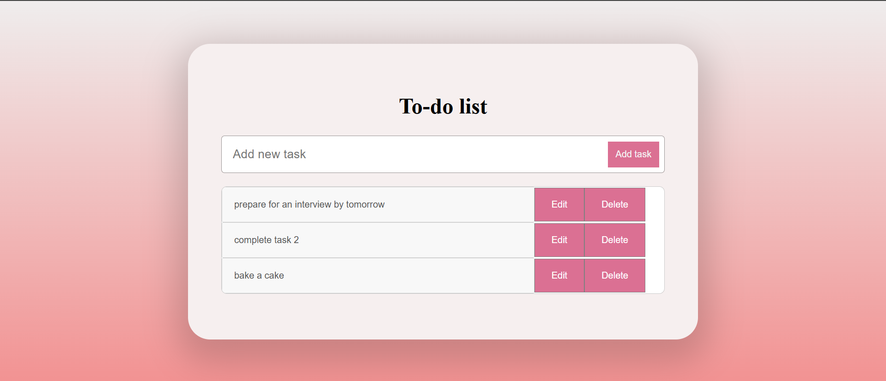

# Todo List App 

This is a simple, clean, and responsive **Todo List Web Application** built using **TypeScript, HTML, and CSS**.  
The app allows users to **add**, **edit**, and **delete** tasks dynamically.  
All tasks are saved in the browser using `localStorage`, so your data is preserved even after refreshing or closing the browser.

---

##  Features

- Add new tasks with a single click or by pressing Enter  
- Edit tasks inline using the edit button  
- Delete tasks by clicking the delete button  
- Tasks are persisted in the browser with `localStorage`  
- Responsive UI with hover effects and scrollable task list  

---

## Screenshots

###  Start Page

*The initial view of the Todo List app.*

###  Add Task

*Adding a new task to the list.*

###  Edit Task

*Editing an existing task.*

###  Save Task

*Saving changes after editing a task.*
###  Delete Task

*Deleting a task from the list.*


---

##  How to Run the App

1. **Clone the repository**:  
   ```bash
   git clone https://github.com/dagi97/todolist_task2
   cd todo_task2
   ```
2. **Open `index.html` in your browser** to use the app. Both `todo.ts` (source) and `todo.js` (compiled JavaScript) are included, so you do not need to compile anything unless you want to make changes to the TypeScript code.

3. **(Optional) If you modify `todo.ts`, recompile it:**
   ```bash
   npm install -g typescript   
   tsc todo.ts
   ```
   This will update `todo.js` with your changes.

---

## Usage Instructions
- **Add a task:** Type your task in the input box and press the Add button or hit Enter.
- **Edit a task:** Click the Edit button next to the task, modify the text, then click Save to update.
- **Delete a task:** Click the Delete button next to the task to remove it.

---

## Project Structure
```
todo_task2/
├── index.html         # Main HTML file
├── styles.css         # CSS styles
├── todo.ts            # TypeScript source code
├── todo.js            # Compiled JavaScript
└── screenshots/       # Screenshots for documentation
```

---

 
 
 